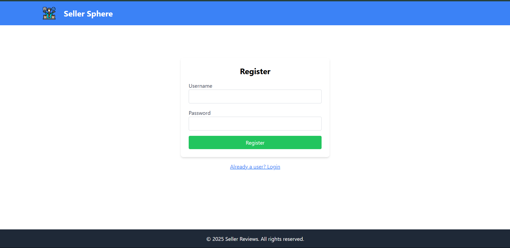
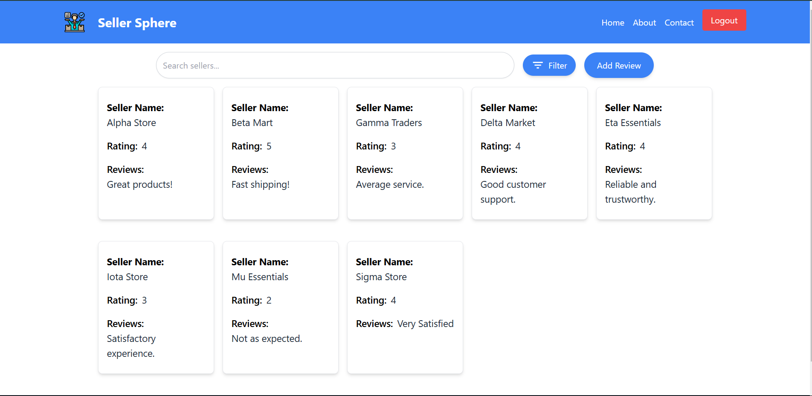

# Seller Sphere SPA

## Description
Seller Sphere SPA is a Single Page Application (SPA) designed to demonstrate full-stack development skills. It includes login functionality, a search feature to find sellers by name, and a display of seller reviews. The application is built with React.js for the frontend, a backend API using Node.js (Express), and a MongoDB database for storing seller data.

---

## Features
- **User Authentication**: 
  - Login functionality with basic validation.
  - Registration feature for new users to create an account.

- **Home Page**:
  - Displays a list of sellers with their ratings and reviews.
  - Search functionality to find sellers by name.
  - Filter functionality to filter sellers based on their ratings.

- **Add Review**:
  - A form to allow users to submit new reviews for sellers.

- **Responsive Design**:
  - Built using **React.js** and styled with **Tailwind CSS** for a clean and modern look.

- **Backend API**:
  - Handles user authentication (login and registration).
  - Provides endpoints to fetch seller data and submit new reviews.

- **Database Integration**:
  - Stores user data, seller information, and reviews securely in the database.

---

## Technologies Used
- **Frontend**: React.js, Tailwind CSS
- **Backend**: Node.js (Express)
- **Database**: MongoDB
- **Version Control**: Git and GitHub

---

## Setup Instructions

### Prerequisites
- **Node.js**: Install from [Node.js official website](https://nodejs.org/en/download)
- **Git**: Ensure Git is installed on your system.

---

### Step 1: Clone the Repository
    git clone https://github.com/Nandhakumar868/SellerSphere.git

    Navigate to the project folder
    cd SellerSphere

### Step 2: Configure Backend
1. Navigate to the backend folder:
   ```bash
   cd backend

2. Install the required dependencies
   ```bash
   npm install

3. Start the backend server
   ```bash
   npm start

### Step 3: Run the frontend
1. Navigate to the frontend folder:
   ```bash
   cd frontend

2. Install the required dependencies
   ```bash
   npm install

3. Start the frontend server
   ```bash
   npm run dev

4. Confirm the frontend is running on http://localhost:5173.

## Usage
1. Ensure both the backend and frontend servers are running.
2. Open your browser and go to http://localhost:5173.
3. Register a new user account using the registration form.
4. Log in with your credentials to access the homepage. 
5. Explore the following features:
    **Search Sellers**: Use the search bar to find sellers by name.
    **Filter by Ratings**: Filter the displayed sellers based on their ratings.
    **Add Reviews**: Submit a new review for any seller.

Below are screenshots of key application pages:

  - 
  - 
  - 